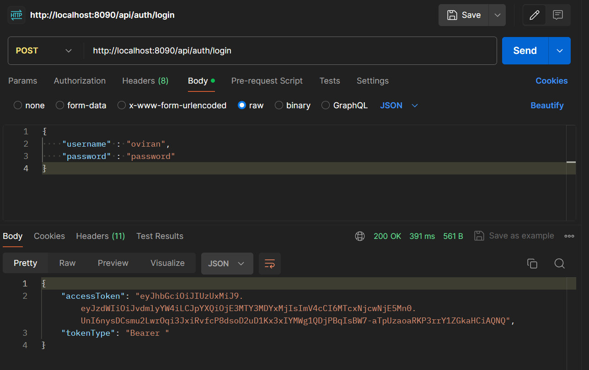
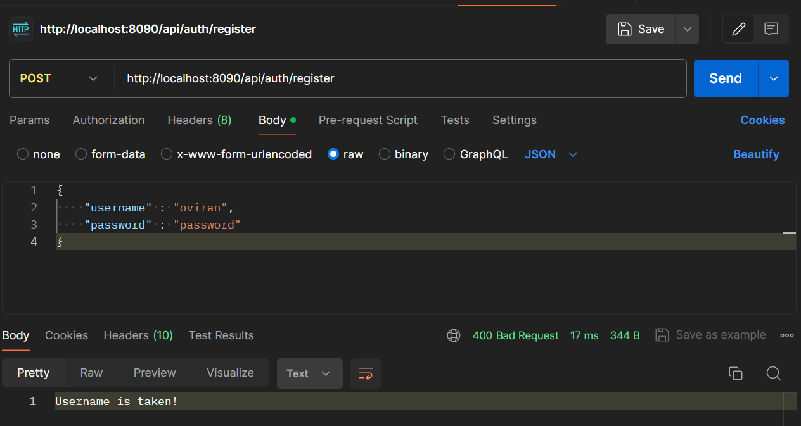
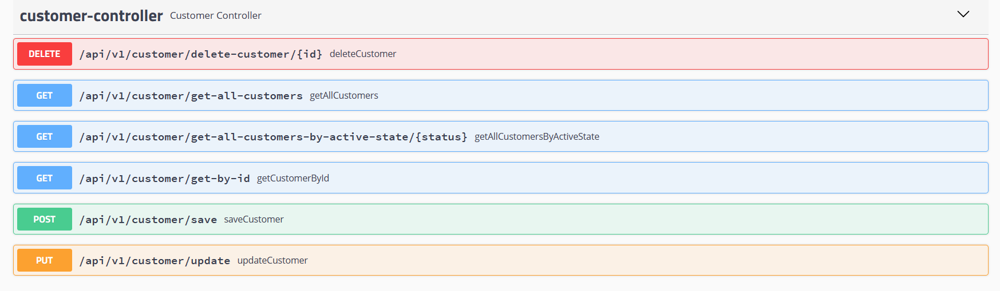
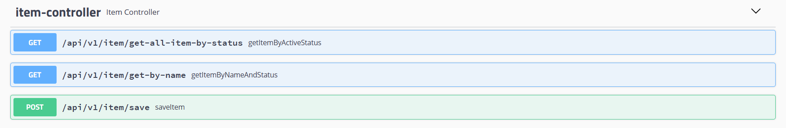

# 🏬 Grocery Store POS System 

This repository contains the source code for a Grocery Store POS System  built using SpringBoot and My SQL.

The project implements Layered Architecture, Exception Handling, repository pattern (CRUD), pagination, custom JWT authorization(Spring Security), it manages database relationships including one-to-one, and one-to-many Hibernate Mapping.

## 👷 Frameworks, Libraries and TechnologiesTechnologies Used

- Java
- SpringBoot
- Spring Beans
- Hibernate
- My SQL 
- Apache Tomcat
- Swagger UI
- Lombok

## 🚀 Quick start

### Clone the repository

```
git clone https://github.com/oviran/POS-System-BackEnd.git
```

### Build the project

Click Run Icon

The project includes a ``web`` service, running the java code, and a ``db`` service, running a My SQL database.


The project can be reached at http://localhost:8090/swagger-ui.html


## 🔧 Implementation features

[comment]: <> (### 🪪 Authentication)

[comment]: <> (Authentication is implemented using a JWT access token &#40;Spring Security&#41;)

[comment]: <> (AccessToken is used to authorize users.)

[comment]: <> (#### 🔐 Login)

[comment]: <> (Allows you to Register and login, Authorize using Token)

[comment]: <> (![Login]&#40;./public/login.png&#41;)

#### 🔐 Login

Allows you to Register and login, Authorize using Token




-
#### 📦 Customer-Controller

Functionality that allows to manage and interact with Customer-Controller

[comment]: <> (&#40;Token required, 🔒manager policy&#41;)



#### 📩 Item-Controller

Functionality that allows to manage and interact with Item-Controller

[comment]: <> (&#40;Token required, 🔒manager policy&#41;)



#### 💼 Order-Controller

Functionality that allows to manage and interact with Order-Controller

[comment]: <> (&#40;Token required, 🔒manager policy&#41;)


## ✍️ Authors

- [OshadhaViran](https://github.com/oviran)

## 📜 License

Distributed under the MIT License. See `LICENSE` for more information.

## 📞 Contact

Oshadha Viran - [@linkedin](https://www.linkedin.com/in/oshadha-viran-847b751a3/) - oviran@gmail.com


